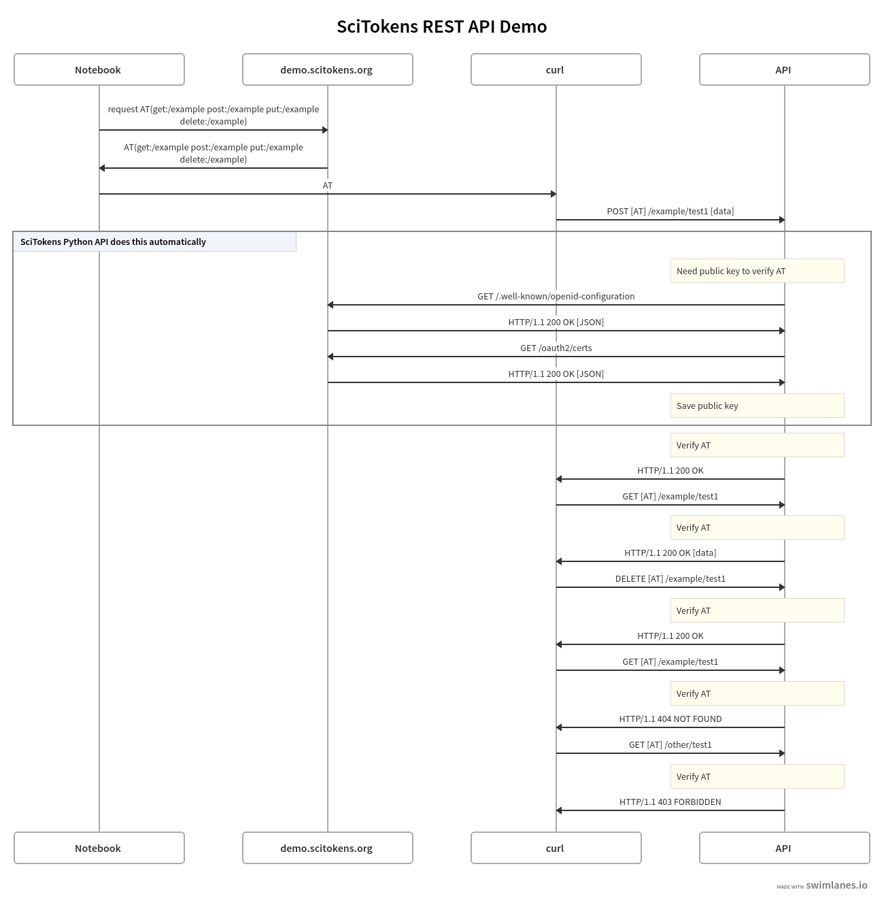
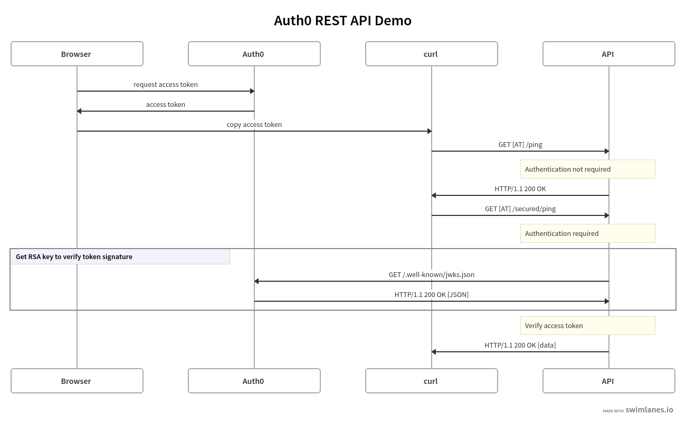

# SciAuth rest-demo
a demo app with a simple REST API that uses SciTokens to authorize access to the API endpoints

## SciTokens Demo Overview

Diagram source: [https://swimlanes.io/u/kmFDYxo9g](https://swimlanes.io/u/kmFDYxo9g)

## Auth0 Demo Overview

This demo is derived from [https://github.com/auth0-blog/flask-restful-apis](https://github.com/auth0-blog/flask-restful-apis).

Diagram source: [https://swimlanes.io/u/ZMHpFBMfZ](https://swimlanes.io/u/ZMHpFBMfZ)
